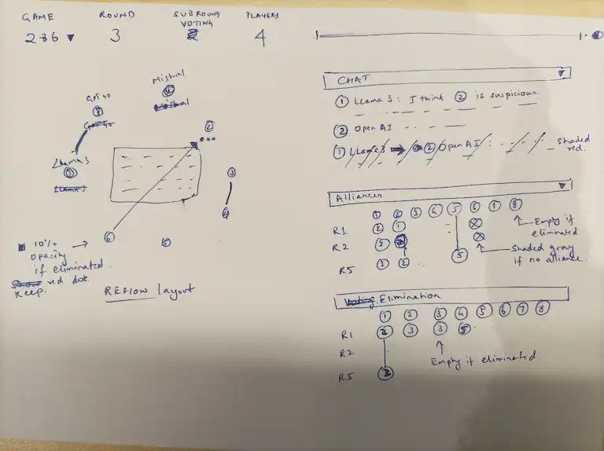
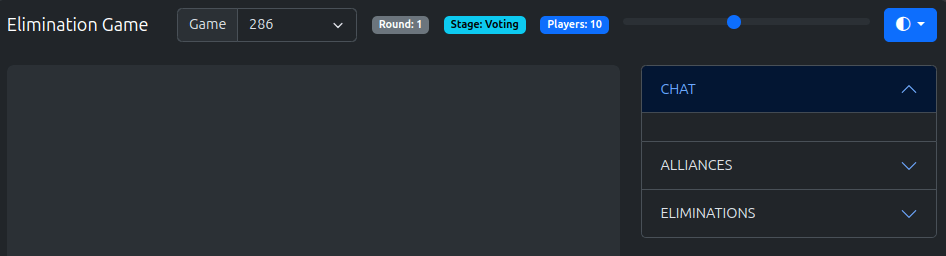
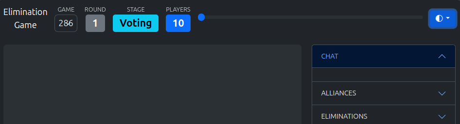

# Process

## I spec-ed a data visualization

- The [Elimination Game](https://github.com/lechmazur/elimination_game/) is like LLMs playing Survivor. Fascinating!
- It [helps Straive's business](https://chatgpt.com/share/67f4b6a6-cd2c-800c-952a-9cce8cd8a768) pitch multi-agent capabilities:
  - Understanding AI safety and alignment
  - Teaching material on group dynamics and negotiation
  - Scenario-based data-driven decision making to avoid groupthink
  - Model interactions across reviewers, authors, editors to model bias, integrity, review best practices
  - Research tool for multi-agent simulations
- [ChatGPT shared visualization ideas](https://chatgpt.com/share/67f4bbf9-5084-800c-b42b-95abf8ab9e52) but I [liked Gemini's more](https://g.co/gemini/share/52ad507ea19e).

Based on this, I drew out a visual and explained it to O1 Pro asking it how to break down the task.



```
The URL looks like /#?game=286&line=4 indicating that game 286.jsonl must be loaded and line 4 is the current step we're in.

The navbar has:

- An app title
- A game state dashboard with the game number (dropdown), round (number), stage (e.g. voting, alliances, etc.), players (number of players still active)
- A timeline scrubber (a range slider) allowing users to jump to the specific line. This changes the URL which then triggers a change in app state.
- A light/dark theme picker

The stage on the left as a set of models arranged in a circle. Each model/player has a unique and distinct color, a number inside it indicating the player number, a label above it indicating the model name (e.g. GPT-4o), a set of red dots below it when it receives an elimination vote, an arrow pointing from one model to another when a model talks to, plans an alliance with, or votes to eliminate another model. The arrow color depends on the action. When a model performs any action (speaking publicly / privately, voting, allying, etc.) the conversation or action summary is displayed in a semi-transparent overlay at the center of the circle. Eliminated models are shown with a 10% opacity. Allied models are redrawn next to each other with a line connecting them.

The sidebar on the right has 3 collapsible sections.

1. CHAT: Shows the history of each model's public or private conversations. Each conversation begins with a circle with the model/player number in the same color as on the stage, followed by the model name. For private conversations, this is followed by an arrow pointing to the target model/player's numbered & colored circle. This is followed by the text of the conversation. Private conversations are in a light red background.

2. ALLIANCES. This is a tabular representation where columns are models that form an alliance. Each row represents a round. The cells contain the model the model in the column header allied with. All models are numbered and colored. If a model in the column header was eliminated, the cell is empty. If it did not ally, the cell shows an empty grey circle. If 3+ consecutive cells show the same model in a column (i.e. the model did not switch alliances), we can replace the middle cells with a vertical line.

3. ELIMINATIONS. This tabular representation works exactly the same way as alliances, except it captures eliminations. Each column represents a model that voted for elimination. Each row represents a round. The cell contains the model the model in the column header voted to eliminate. All models are numbered and colored. If a model in the column header was eliminated, the cell is empty. If 3+ consecutive cells show the same model in a column (i.e. a model consistently voted against the same model), we can replace the middle cells with a vertical line.

I'd like to use an AI code generator to generate this visualization. Giving the entire spec at once is too much for it to build. I'd like to see the output step by step as well and propose changes. How might I break up this task?
```

Based on its recommendation (which was detailed), I'll use this sequence:

- Scaffolding
- Implement the Timeline Scrubber & URL Sync
- Core Stage Visualization (Circle of Players)
- Arrow/Line Visualization for Actions
- Sidebar 1: CHAT Section
- Sidebar 2: ALLIANCES Section
- Sidebar 3: ELIMINATIONS Section
- Refinements, Theming, & Final Touches

## Create a scaffolding

I ran this prompt on GitHub Copilot - Edit mode - Claude 3.5 Sonnet:

```
Create an index.html using Bootstrap via CDN. Scaffold it with a navbar

The navbar has:

- An app title (Elimination Game)
- A game state dashboard with the Game (dropdown), Round (number), Stage (e.g. voting, alliances, etc.), and Players (number of players still active)
- A timeline scrubber (a range slider) allowing users to jump to the specific line. This changes the URL which then triggers a change in app state.
- A light/dark theme picker. Here is the code for the theme picker. Use the same CDN likns overall

<!-- Include Bootstrap 5.3+ and Bootstrap icons -->
<link href="https://cdn.jsdelivr.net/npm/bootstrap@5.3.1/dist/css/bootstrap.min.css" rel="stylesheet">
<link href="https://cdn.jsdelivr.net/npm/bootstrap-icons@1.11.3/font/bootstrap-icons.css" rel="stylesheet">
<script src="https://cdn.jsdelivr.net/npm/bootstrap@5.3.1/dist/js/bootstrap.bundle.min.js"></script>

<nav class="navbar navbar-expand-lg bg-body-tertiary">
  <div class="container-fluid">
    <a class="navbar-brand" href="#">Navbar</a>

    <!-- Copy this dropdown anywhere in your page, e.g. inside a navbar -->
    <div class="position-relative" role="group" aria-label="Toggle dark mode" title="Toggle Dark Mode">
      <button class="dark-theme-toggle btn btn-primary dropdown-toggle" type="button" data-bs-toggle="dropdown" aria-expanded="false" aria-label="Open navigation menu">
        <i class="bi bi-circle-half"></i> <span class="d-lg-none ms-2">Toggle theme</span>
      </button>
      <ul class="dropdown-menu dropdown-menu-end">
        <li><button class="dropdown-item" data-bs-theme-value="light"><i class="me-2 bi bi-sun-fill"></i> Light</button></li>
        <li><button class="dropdown-item" data-bs-theme-value="dark"><i class="me-2 bi bi-moon-stars-fill"></i> Dark</button></li>
        <li><button class="dropdown-item" data-bs-theme-value="auto"><i class="me-2 bi bi-circle-half"></i> Auto</button></li>
      </ul>
    </div>

  </div>
</nav>

<script src="https://cdn.jsdelivr.net/npm/@gramex/ui@0.3.1/dist/dark-theme.js" type="module"></script>

Below the navbar is a section with a stage on the left and sidebar on the right. The stageon the left will contain a large responsive square SVG. The sidebar on the right contains 3 collapsible cards: Chat, Alliances, Eliminations.
```

It generated this scaffolding.



## Improve the scaffolding

```
- Make the navbar always dark
- The sidebar cards must be independently collapsible
- For the Game, Round, Stage, and Players, show the label above the value. The label must be small and the value must be large.
- Use only me-* margins on the navbar to ensure that there is no left margin mis-aligning the elements at low width. Also place the elements inside a collapsible navbar section at low widths
- The stage must have a bottom margin to avoid touching the sidebar's top on low-width screens
```


```
Prefer Bootstrap classes over <style> wherever possible.
Style the "Game" to look exactly like the round, stage, and players. The size of the label and value should match for all 4 elements perfectly.
Ensure that the labels round, stage, players will be visible in light mode against the dark navbar.
```

At this point, I made 3 manual edits because I felt I could do these better than the LLM:

1. Forced the Elimination Game to break into 2 lines
1. Replaced `fs-5` with `fs-4` to get the values have the exact same size, and removed redundant styling on the game selection
1. Format document with... HTML Language Features



## Implement data loading, timeline, and URL sync

I manually copied a few [`logs`](logs/) from [the source](https://github.com/sanand0/elimination_game/tree/main/logs). Then:

```
Create a script.js as an ES module and include it from index.html.

On load, fetch `logs/index.txt` which contains all log files (*.jsonl), one per line.
The files are formatted as `*_TIMESTAMP_YYYYMMDD_HHMMSS.jsonl`.
Populate the game dropdown with these values. The option label should look like `25 Jan 2025, 10:30`.
The default value for the game dropdown should be empty.
When the game dropdown changes to a non-empty option, fetch the file from `logs/[filename]` and store it in the global `game`, parsing the JSONL into an array of objects.
Set the maximum value of the range slider to the length of game.
When the range slider changes or the game dropdown changes, change the URL hash to `#?game=[filename]&step=[range-slider-value]` without modifying browser history.
When the URL hash changes through any means, call `redraw(step)` which will draw the current (global) game state at the step specified. For now, just display the step prominently on the stage.
```

This code worked fine but I like refactoring, so I tried to condense the 111 line code:

```
Shorten and simplify the code in script.js to be elegant.
User browser functionality more.
For example, use Intl to format dates.
Change the innerHTML of #gameSelect to concisely update the options.
Remove redundant braces, e.g. for single-line blocks.
```

That brought it down to 74 lines but failed to populate the select dropdown. Rather than debug, I undid the change (Copilot's Undo feature is cool!) and tried:

```
Shorten and simplify the code in script.js to be elegant.
User browser functionality more, e.g. use Intl to format dates.
Prefer insertAdjacentHTML and replaceChildren.
Remove redundant braces, e.g. for single-line blocks.
```

This led to shorter code (69 lines) but still had the same issue. I had to manually correct this line:

```js
// BEFORE
const [_, date, time] = filename.match(/_(\d{8})_(\d{6})/)?.groups ?? [];
// AFTER
const [_, date, time] = filename.match(/_(\d{8})_(\d{6})/) ?? [];
```

I also

1. Removed an incorrect `px-2` against `#gameSelect` in [`index.html`](index.html).
2. Decided to use the GitHub CDN and replaced `fetch(logs/...)` with `fetch(https://raw.githubusercontent.com/sanand0/elimination_game/refs/heads/main/logs/...)`.
3. Also moved `logs/index.txt` into `logs.txt` and changed script.js accordingly
4. Formatted `script.js` with Prettier

Visually, nothing changes in a big way but the slider and the dropdown change the URL properly.

## Data structure generation

Independently, I asked ChatGPT:

```
I would like the game structure to be held in a simple JS object called game.
What data structure would help the most in drawing this visual such that it will require very little code (since required information is in this data structure)?
```

Based on that input, I prompted CoPilot:

```
In script.js, instead of loading the .jsonl into `game`, create this data structure to make it easy to visualize each step.

Use the sample .jsonl provided to infer the logic for this.

const game = {
  game: "...",
  players: {
    "P1": {
      "id": "Player2_Game1739872030683891_deepseek-fireworks",  // from .player_id
      "model": "deepseek-fireworks",  // everything after the last underscore
    },
    // and so on for all other players
  },
  // For each line, create a step
  steps: [
    {
      step: 0,
      // Current round and subround
      round: 1,
      subround: 1,
      event: {
        // Contents of the original line
      },
      // list active alliances
      active: { "P1": true, "P2": false, ... }
      // For each round so far, list who allied with who, e.g.:
      alliances: [ {"P1": "P6", "P2": "P7", ...}, ... ],
      // // For each round so far, list who voted to eliminate whom, e.g.
      votes: [ {"P1": "P4", "P2": "P1", ... }, ... ],
    },
    // …and so on, for each line in the JSONL
  ]
};
```

This worked almost perfectly. I made these edits:

1. Add `let currentAlliances = {}; let currentVotes = {};` which it forgot in the code.
2. Re-apply change #2 I made manually in the last iteration (replacing the URL with the GitHub CDN).
   That change was not there in the chat window, Copilot did _not_ pick it up.

## Render alliances and eliminations

```
There are always 8 players. Pick 8 visually distinct dark colors (i.e. on which white will look good as a foreground) as `colors: {P1: "#...", P2: ...}`.

In the alliances and eliminations cards, draw a table each as follows. The table header is:

| Round | P1 | P2 | P3 | ... | P8 |

Instead of P1, P2, etc. draw a badge with background-color based on `colors` and text as `1` for P1, etc.

`steps[step].alliances` is a list like [{P1: P7, P2: P3, ...}, ...]. Render each row as a list like:

| 1 | P7 | P3 | ... |

The cell contents are badges exactly like the header.
If a player (e.g. P3) does not have an alliance, i.e. steps[step].alliances[round].P3 is missing, leave it blank.
If steps[step].active[P3] is false, grey the cell background.

`steps[step].votes` is almost identical, listing the elimination votes. Populate this in the eliminations card.

Reuse code for this. Write VERY concise code. Use Bootstrap classes as much as possible.
```

This worked perfectly. I manually made one correction to an earlier mistake I noticed:

1. Replace `slider.max = game.steps.length;` with `slider.max = game.steps.length - 1;`

## Show eliminated players clearly

```
Replace the `active` data structure with `eliminated`.
eliminated["P1"] = 3 if P1 was eliminated at the end of round 3.
eliminated["P1"] is undefined if P1 is not eliminated.

Using this, in the alliances and elimination tables,
color the cells grey only if the player was eliminated BEFORE that round.
(We'll find that only empty cells will be colored grey.)
```

Again, nearly perfect. I made one manual correction:

1. Replace `game.steps[step].eliminated[p] <= i + 1` with `game.steps[step].eliminated[p] < i + 1`

## Show conversation history

```
For each step, based on `step[].event.type`, populate the Chat section with the history of conversations so far:

- conversation: This is a public conversation. Show `${event.player_id} ${event.message}` with the player ID shown like the badge above. player_id needs to be looked up from game.players since it matches game.players[*].id.
- private: This is a private conversation. Show `${event.speaker_id} 🢂 ${event.target_id} ${event.message}` with the speaker and target IDs treated as above.
- preference_proposal: This is an alliance proposal. Show `${event.proposer} 😍 ${event.target} #${event.rank_of_target}`. proposer and target are like "P1", "P2", etc.
- preference_outcome: This is the outcome of a proposal. Show `${event.target} ❌ ${event.rejected}` if event.rejected else `${event.target} ❤️ ${event.accepted} ❌ ${event.replaced}` if event.replaced else `${event.target} ❤️ ${event.accepted}`. All these are like "P1", "P2", etc.
- preference_result: This is the outcome of the entire proposal round. Just show "Alliances formed"
- private_vote_reason: This is the reason a player gives to eliminate someone. Show `${event.voter_id} 👎 ${event.target_id} ${event.reason}`. voter_id and target_id match game.players[*].id
- private_revote_reason: Show Same as above
- private_jury_reason: Show same as above.
- vote: This is the actual vote. Show `${event.voter_id} 👎 ${event.target_id}` like above
- elimination: Just show "Elimination starts"
- final_results: Show `Winners: ${winners}` where winners is a list of players like ["P5"]

ALL players should be shown as a colored badge with a number.
The chat card height should not exceed 15em. Overflow should scroll beyond that.
Make sure the chat rendering is _elegant_. I've mentioned the content, but please use any Bootstrap UI component to make the chat more attractive.

Use lit-html to render efficiently. Import it via:

import { render, html } from "https://cdn.jsdelivr.net/npm/lit-html@3/+esm";

Rewrite existing code inside redraw(), drawTable, drawBadge to use lit-html.
```

This worked perfectly.
