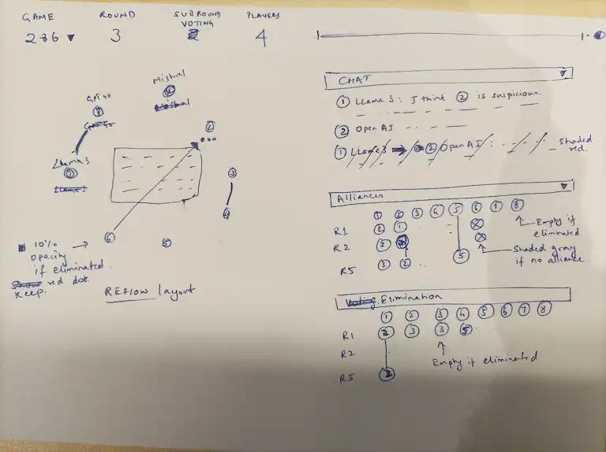

# Process

## I spec-ed a data visualization

- The [Elimination Game](https://github.com/lechmazur/elimination_game/) is like LLMs playing Survivor. Fascinating!
- It [helps Straive's business](https://chatgpt.com/share/67f4b6a6-cd2c-800c-952a-9cce8cd8a768) pitch multi-agent capabilities:
  - Understanding AI safety and alignment
  - Teaching material on group dynamics and negotiation
  - Scenario-based data-driven decision making to avoid groupthink
  - Model interactions across reviewers, authors, editors to model bias, integrity, review best practices
  - Research tool for multi-agent simulations
- [ChatGPT shared visualization ideas](https://chatgpt.com/share/67f4bbf9-5084-800c-b42b-95abf8ab9e52) but I [liked Gemini's more](https://g.co/gemini/share/52ad507ea19e).

Based on this, I drew out a visual and explained it to O1 Pro asking it how to break down the task.



```
The URL looks like /#?game=286&line=4 indicating that game 286.jsonl must be loaded and line 4 is the current step we're in.

The navbar has:

- An app title
- A game state dashboard with the game number (dropdown), round (number), stage (e.g. voting, alliances, etc.), players (number of players still active)
- A timeline scrubber (a range slider) allowing users to jump to the specific line. This changes the URL which then triggers a change in app state.
- A light/dark theme picker

The stage on the left as a set of models arranged in a circle. Each model/player has a unique and distinct color, a number inside it indicating the player number, a label above it indicating the model name (e.g. GPT-4o), a set of red dots below it when it receives an elimination vote, an arrow pointing from one model to another when a model talks to, plans an alliance with, or votes to eliminate another model. The arrow color depends on the action. When a model performs any action (speaking publicly / privately, voting, allying, etc.) the conversation or action summary is displayed in a semi-transparent overlay at the center of the circle. Eliminated models are shown with a 10% opacity. Allied models are redrawn next to each other with a line connecting them.

The sidebar on the right has 3 collapsible sections.

1. CHAT: Shows the history of each model's public or private conversations. Each conversation begins with a circle with the model/player number in the same color as on the stage, followed by the model name. For private conversations, this is followed by an arrow pointing to the target model/player's numbered & colored circle. This is followed by the text of the conversation. Private conversations are in a light red background.

2. ALLIANCES. This is a tabular representation where columns are models that form an alliance. Each row represents a round. The cells contain the model the model in the column header allied with. All models are numbered and colored. If a model in the column header was eliminated, the cell is empty. If it did not ally, the cell shows an empty grey circle. If 3+ consecutive cells show the same model in a column (i.e. the model did not switch alliances), we can replace the middle cells with a vertical line.

3. ELIMINATIONS. This tabular representation works exactly the same way as alliances, except it captures eliminations. Each column represents a model that voted for elimination. Each row represents a round. The cell contains the model the model in the column header voted to eliminate. All models are numbered and colored. If a model in the column header was eliminated, the cell is empty. If 3+ consecutive cells show the same model in a column (i.e. a model consistently voted against the same model), we can replace the middle cells with a vertical line.

I'd like to use an AI code generator to generate this visualization. Giving the entire spec at once is too much for it to build. I'd like to see the output step by step as well and propose changes. How might I break up this task?
```

Based on its recommendation (which was detailed), I'll use this sequence:

- Scaffolding
- Implement the Timeline Scrubber & URL Sync
- Core Stage Visualization (Circle of Players)
- Arrow/Line Visualization for Actions
- Sidebar 1: CHAT Section
- Sidebar 2: ALLIANCES Section
- Sidebar 3: ELIMINATIONS Section
- Refinements, Theming, & Final Touches
