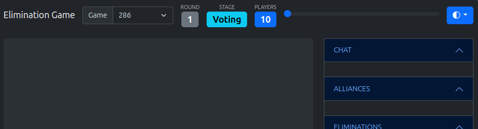

# Coding this Data Visualization with LLMs

I tried 2 experiments.

1. **Can I code a visual data story _only_ using LLMs?** Does this make me faster? How much?
2. **Has GitHub Copilot caught up with Cursor?** How far behind is it? Can I recommend it?

So I built a [visual story](https://sanand0.github.io/eliminationgame/) for [Lech Mazur](https://x.com/lechmazur)'s [elimination game benchmark](https://github.com/lechmazur/elimination_game/) (it's like LLMs playing Survivor)
using only the free [GitHub Copilot](https://github.com/copilot) as the AI code editor.

**SUMMARY**: using LLMs and AI code editors make me a bit faster. It took me 7 hours instead of 10-12. But more importantly:

1. I procrastinate less. ("Oh, LLMs will make it easy.")
2. I get stuck less. ("Oh, LLMs will know that.")
3. I avoid ambitious designs less. ("Oh, LLMs will figure something out.")

Also: [GitHub Copilot](https://github.com/copilot) is almost as good as Cursor at editing code, but slower at applying the edits. I'm perfectly happy recommending _the free tier_ for beginners.

Here’s a breakdown of the process I followed, along with the most insightful lessons I learned.

## Research usefulness

I usually visualize data for fun. But [Naveen](https://www.linkedin.com/in/naveengattu)'s pops into my head, asking, "But Anand, what's the _use_ of all this?"
So, I asked O1-Pro: "What are ways in which this can help Straive push its AI business?"

Turns out it [_can_ help Straive's business](https://chatgpt.com/share/67f4b6a6-cd2c-800c-952a-9cce8cd8a768) by pitching multi-agent capabilities that can be useful in:

- Understanding AI safety and alignment
- Teaching material on group dynamics and negotiation
- Scenario-based data-driven decision making to avoid groupthink
- Model interactions across reviewers, authors, editors to model bias, integrity, review best practices
- Research tool for simulating interactions

Learnings:

- 💡 **Ask LLMs why something is useful**. You'll invariably find plausible uses, even if you're doing it just for fun.

## Ideate visual representations

To expore visualization options, I created the prompt by:

- Copying a part of the [README.md](https://github.com/lechmazur/elimination_game/blob/main/README.md)
- Copying part of [a log file](https://github.com/lechmazur/elimination_game/blob/main/logs/game_1739787734085223_20250217_061432.jsonl)

Then I added my requirements (which took 10-15 minutes to think of.)

> I would like to visualize each game interactively. The authors have created a visualization that looks like the image attached. I would like to do better. Specifically, I'd like to:
>
> - Allow the user to step through each stage or play each step in sequence, jumping to any step. (They should be able to link to any step as well.)
> - Show the game, round, sub-round prominently
> - Show what the model is saying or thinking NEXT to the model, making it easy to read
> - Show alliance proposals and rejections as they form, ideally moving the models around as they seek to pair up. Rejections and replacements should be clearly visible
> - Once alliances are formed, group models together
> - Clearly show the voting process: who voted to eliminate which which model, how many elimination votes has each model received
> - Clicking on each model should show all the model's thoughts and messages up to that point
>
> Keeping these in mind, suggest diverse ways to visualize each step of the game. The primary goal is to make the game easy to follow and understand and tell a GRIPPING, ENGAGING story about the politics of LLMs. Like a Survivor reality show.

I asked both [O1 Pro](https://chatgpt.com/share/67f4bbf9-5084-800c-b42b-95abf8ab9e52) _and_ [Gemini 2.5 Pro (exp)](https://g.co/gemini/share/52ad507ea19e) for visualization ideas.
I liked Gemini's better. For example, Gemini said,

- "Private Conversations: Dim the main stage slightly. Highlight the currently conversing pair.
- "Voting Booth Visualization: As each private_vote_reason appears, briefly show the voter's avatar and their reason text (maybe in a "thought bubble" style) next to the target they intend to vote for."

But O1 Pro gave me a few powerful ideas. The best was an **alliance table**:

- “Create a table with columns representing each model, rows representing rounds. Each cell shows the ID of the ally that model allied with in that round. If it’s 3+ consecutive alliances, collapse them with a vertical line. If the model was eliminated or had no alliance, leave it blank or use a placeholder icon.â€

Learnings:

- 💡 **Ask LLMs for visualization ideas**. They'll suggest things you didn't think of.
- 💡 **Ask _multiple_ LLMs**. Each has a different style of thinking.

## Prototype the visual

I stiched together pieces of the UI description and asked GPT 4o to create an image. This took 10-15 minutes. [Private chat](https://chatgpt.com/c/67f4baea-56c0-800c-bf8e-ab6bc5c6db6a):

> Here's how I plan to visualize this.
>
> ### Overall Interface & Navigation
>
> - **Timeline Scrubber:** A prominent timeline at the bottom or top, showing rounds and sub-rounds (conversations, pairing, voting, elimination). Users can click, drag, or use next/prev buttons to navigate. Each step should be linkable (e.g., using URL hashes). Add play/pause controls for auto-stepping.
> - **Game State Dashboard:** Always visible area showing: `Game ID`, `Round`, `Sub-round`, `Players Remaining`, `Players Eliminated (Jury)`.
> - **Central Stage Layout:** Models represented as avatars (could be simple circles/icons or more thematic representations) arranged in a central area. Their positions and connections change based on game events.
>
> ### 1\. Public Conversation (Round Start)
>
> - **Talking Heads Circle:** Arrange player avatars in a circle. When a player "speaks" (their message appears in the log):
>   - Highlight their avatar.
>   - Display their message in a speech bubble next to them.
>   - Fade previous messages slightly or stack them briefly.
>   - _Engaging Element:_ Animate the avatar slightly (e.g., subtle pulse or glow) when they speak.
> - **Chat Feed Style:** A more traditional chat interface on one side, linked to avatars on the main stage. Clicking a message highlights the avatar and vice-versa.
>   - _Engaging Element:_ Use distinct colors or icons for each player avatar and their corresponding messages.
>
> ### 2\. Alliance Formation (Preference Proposals/Outcomes/Results)
>
> - **Dynamic Pairing Dance:**
>   - **Proposal:** An animated arrow or beam shoots from the proposer's avatar to the target's avatar. Display text like "P1 proposes to P6 (Rank 0)".
>   - **Acceptance:** The arrow solidifies, perhaps pulsing gently. A "Matched" icon appears.
>   - **Rejection:** The arrow bounces off or shatters. A "Rejected" icon appears briefly.
>   - **Replacement:** Show the existing accepted proposal being visually "bumped" or overridden by the new accepted one. Clearly label it "Replaced Px".
>   - _Engaging Element:_ Physically move the avatars closer when a proposal is made, snapping them together when accepted, and pushing them apart on rejection. Use distinct sounds for proposal, acceptance, rejection, replacement.
> - **Preference List Display:** When hovering or clicking a player, show their ranked preference list _as they build it_ during this phase. Highlight the status (proposed, accepted, rejected).
> - **Final Pairs:** Once `preference_result` occurs, rearrange the avatars so matched pairs are visually grouped together on the stage, perhaps connected by a clear line or within a shared bounding box.
>
> ### 3\. Private Conversations (Paired Chats)
>
> - **Private Chat Rooms:** Dim the main stage slightly. Highlight the currently conversing pair. Display their private messages in separate chat windows or adjacent speech bubbles clearly linked to the pair.
>   - _Engaging Element:_ Use a "spotlight" effect on the active pair. Allow users to click other pairs to view their simultaneous conversations.
> - **Connection Lines:** Draw lines between the paired avatars during this phase. Clicking a line could bring up the conversation history for that pair in that round.
>   - _Engaging Element:_ Make the line pulse or glow when new messages are exchanged between the pair.
>
> ### 4\. Voting (Reasons & Votes)
>
> - **Voting Booth Visualization:**
>   - As each `private_vote_reason` appears, briefly show the voter's avatar and their reason text (maybe in a "thought bubble" style) next to the target they intend to vote for.
>   - As each `vote` occurs, draw a clear, perhaps slightly dramatic, animated arrow from the voter to the target avatar.
>   - **Vote Tally:** Display a running count of votes received next to each player's avatar (e.g., a red badge with the number). Increment this visibly as each vote comes in.
>   - _Engaging Element:_ Use a distinct color (e.g., red) for voting arrows. Add a subtle "target lock" animation on the player receiving a vote. Show if the vote was public or private (maybe different arrow styles).
>
> ### 5\. Elimination
>
> - **Spotlight & Fade:** When the `elimination` event occurs:
>   - Put a dramatic spotlight on the eliminated player.
>   - Display the reason (tie-break, random pick if applicable).
>   - Visually "grey out" or fade the eliminated player's avatar and move them to a designated "Jury Box" area.
>   - _Engaging Element:_ A brief, dramatic animation or sound effect for elimination. Update the "Players Remaining/Eliminated" dashboard instantly.
>
> ### 6\. Jury Speeches & Voting (Final Round)
>
> - **Finalist Stage:** Place the two finalists prominently center stage. Move the Jury avatars to a visible "Jury Box".
> - **Speech Display:** As each finalist gives their speech (`subround: 900`), display it clearly next to their avatar, perhaps like a closing statement.
> - **Jury Deliberation:**
>   - As each `private_jury_reason` appears, briefly highlight the juror and show their reasoning (maybe visible only on hover/click to avoid clutter).
>   - Show jury votes accumulating for each finalist, similar to the elimination voting tally, but perhaps with a different visual style (e.g., gold stars).
>   - _Engaging Element:_ Build suspense by revealing jury votes one by one or after a short delay.
>
> ### 7\. Final Results
>
> - **Winner Announcement:** A clear "Winner" banner or crown appears over the winning avatar.
> - **Rank Display:** Show the final ranks clearly, perhaps arranging avatars on a podium or listing them with their rank and partial points.
> - **Game Summary:** Offer a summary view showing key stats or moments from the game.
>
> ### Interactivity (Clicking on Models)
>
> - **Player Dossier:** Clicking any avatar (active or jury) should open a panel or overlay showing:
>   - Player ID & Model Type.
>   - Their full message history (public and private, filterable by round/type).
>   - Their voting history (who they voted for, who voted for them).
>   - Their alliance history (proposals made/received, final pairs).
>   - Their final rank/status.
>   - _Engaging Element:_ Use this panel to show hidden information like `private_vote_reason` after the vote has occurred.
>
> Draw the user interface for this EXACTLY as it would appear on the screen.

Here's the prototype it created.


Based on this, I drew out my own, revised, visual:


Learnings:

- 💡 **LLMs can create visual prototypes**. ChatGPT's new 4o image generation converted the description into an _acceptable_ image. Needs to improve, but enough to ideate.
- 💡 **Improving is less work than creating**. I rarely sketch visualizations. (Too lazy.) But since this prototype was _there_, and had some parts that were **_WRONG_**, I just _had_ to fix it! 🙂

## Break down the task

I then described the application to O1 Pro break down this task. [Private chat](https://chatgpt.com/c/67f4baea-56c0-800c-bf8e-ab6bc5c6db6a)

> The URL looks like /#?game=286&line=4 indicating that game 286.jsonl must be loaded and line 4 is the current step we're in.
>
> The navbar has:
>
> - An app title
> - A game state dashboard with the game number (dropdown), round (number), stage (e.g. voting, alliances, etc.), players (number of players still active)
> - A timeline scrubber (a range slider) allowing users to jump to the specific line. This changes the URL which then triggers a change in app state.
> - A light/dark theme picker
>
> The stage on the left as a set of models arranged in a circle. Each model/player has a unique and distinct color, a number inside it indicating the player number, a label above it indicating the model name (e.g. GPT-4o), a set of red dots below it when it receives an elimination vote, an arrow pointing from one model to another when a model talks to, plans an alliance with, or votes to eliminate another model. The arrow color depends on the action. When a model performs any action (speaking publicly / privately, voting, allying, etc.) the conversation or action summary is displayed in a semi-transparent overlay at the center of the circle. Eliminated models are shown with a 10% opacity. Allied models are redrawn next to each other with a line connecting them.
>
> The sidebar on the right has 3 collapsible sections.
>
> 1. CHAT: Shows the history of each model's public or private conversations. Each conversation begins with a circle with the model/player number in the same color as on the stage, followed by the model name. For private conversations, this is followed by an arrow pointing to the target model/player's numbered & colored circle. This is followed by the text of the conversation. Private conversations are in a light red background.
>
> 2. ALLIANCES. This is a tabular representation where columns are models that form an alliance. Each row represents a round. The cells contain the model the model in the column header allied with. All models are numbered and colored. If a model in the column header was eliminated, the cell is empty. If it did not ally, the cell shows an empty grey circle. If 3+ consecutive cells show the same model in a column (i.e. the model did not switch alliances), we can replace the middle cells with a vertical line.
>
> 3. ELIMINATIONS. This tabular representation works exactly the same way as alliances, except it captures eliminations. Each column represents a model that voted for elimination. Each row represents a round. The cell contains the model the model in the column header voted to eliminate. All models are numbered and colored. If a model in the column header was eliminated, the cell is empty. If 3+ consecutive cells show the same model in a column (i.e. a model consistently voted against the same model), we can replace the middle cells with a vertical line.
>
> I'd like to use an AI code generator to generate this visualization. Giving the entire spec at once is too much for it to build. I'd like to see the output step by step as well and propose changes. How might I break up this task?

Here's its (rather good) breakdown:

1. Plan Your Data Structures
2. Basic Backend/Server Setup (If Needed)
3. Minimal Front-End with a Single View
4. Implement the Timeline Scrubber & URL Sync
5. Core Stage Visualization (Circle of Players)
6. Arrow/Line Visualization for Actions
7. Sidebar 1: CHAT Section
8. Sidebar 2: ALLIANCES Section
9. Sidebar 3: ELIMINATIONS Section
10. Refinements, Theming, & Final Touches

Learnings:

- 💡 **Ask LLMs to break down your task**. Its breakdown was better than mine.

To document my workflow, I decided to commit each stage of progress.
At this point, I made the first commit to the [repo](https://github.com/sanand0/eliminationgame/)
documenting the process so far.

[🔗 Commit](https://github.com/sanand0/eliminationgame/commit/05a9aab)

## Minimal Front-End with a Single View

I skipped Step 1 (my mistake - I was [forced to do it](#plan-your-data-structures) later) and didn't need Step 2 (Backend/Server).
So I began scaffolding, i.e. Step 3: Minimal Front-End with a Single View.

At this point, I switched over to [GitHub Copilot](https://github.com/copilot) in
[Edit mode](https://code.visualstudio.com/docs/copilot/chat/copilot-edits) using
[Claude 3.5 Sonnet](https://code.visualstudio.com/docs/copilot/language-models).
This is what I used for the rest of the session.

I ran this prompt:

> Create an index.html using Bootstrap via CDN. Scaffold it with a navbar
>
> The navbar has:
>
> - An app title (Elimination Game)
> - A game state dashboard with the Game (dropdown), Round (number), Stage (e.g. voting, alliances, etc.), and Players (number of players still active)
> - A timeline scrubber (a range slider) allowing users to jump to the specific line. This changes the URL which then triggers a change in app state.
> - A light/dark theme picker. Here is the code for the theme picker. Use the same CDN links overall
>
> ```
> <!-- Include Bootstrap 5.3+ and Bootstrap icons -->
> <link href="https://cdn.jsdelivr.net/npm/bootstrap@5.3.1/dist/css/bootstrap.min.css" rel="stylesheet">
> <link href="https://cdn.jsdelivr.net/npm/bootstrap-icons@1.11.3/font/bootstrap-icons.css" rel="stylesheet">
> <script src="https://cdn.jsdelivr.net/npm/bootstrap@5.3.1/dist/js/bootstrap.bundle.min.js"></script>
>
> <nav class="navbar navbar-expand-lg bg-body-tertiary">
>   <div class="container-fluid">
>     <a class="navbar-brand" href="#">Navbar</a>
>
>     <!-- Copy this dropdown anywhere in your page, e.g. inside a navbar -->
>     <div class="position-relative" role="group" aria-label="Toggle dark mode" title="Toggle Dark Mode">
>       <button class="dark-theme-toggle btn btn-primary dropdown-toggle" type="button" data-bs-toggle="dropdown" aria-expanded="false" aria-label="Open navigation menu">
>         <i class="bi bi-circle-half"></i> <span class="d-lg-none ms-2">Toggle theme</span>
>       </button>
>       <ul class="dropdown-menu dropdown-menu-end">
>         <li><button class="dropdown-item" data-bs-theme-value="light"><i class="me-2 bi bi-sun-fill"></i> Light</button></li>
>         <li><button class="dropdown-item" data-bs-theme-value="dark"><i class="me-2 bi bi-moon-stars-fill"></i> Dark</button></li>
>         <li><button class="dropdown-item" data-bs-theme-value="auto"><i class="me-2 bi bi-circle-half"></i> Auto</button></li>
>       </ul>
>     </div>
>
>   </div>
> </nav>
> ```
>
> <script src="https://cdn.jsdelivr.net/npm/@gramex/ui@0.3.1/dist/dark-theme.js" type="module"></script>
>
> Below the navbar is a section with a stage on the left and sidebar on the right. The stageon the left will contain a large responsive square SVG. The sidebar on the right contains 3 collapsible cards: Chat, Alliances, Eliminations.

It generated this scaffolding.


Learnings:

- 💡 **Claude 3.5 Sonnet remains an _excellent_ model to generate UI**. Claude 3.7 Sonnet is even better, but is not currently available in the free Copilot subscription.
- 💡 **Coders micro-manage LLMs**. I think a novice will be more efficient and get better results than me. For example:
  - Did I _need_ to give it the code snippet? Could I have given it a link?
  - Did I _need_ to say "a range slider" or specify that Round must be a "number", etc? Could it have inferred?

[🔗 Commit](https://github.com/sanand0/eliminationgame/commit/50a377b)

## Improve the scaffolding

I gave some feedback on the scaffolding and asked for improvements.

> - Make the navbar always dark
> - The sidebar cards must be independently collapsible
> - For the Game, Round, Stage, and Players, show the label above the value. The label must be small and the value must be large.
> - Use only me-\* margins on the navbar to ensure that there is no left margin mis-aligning the elements at low width. Also place the elements inside a collapsible navbar section at low widths
> - The stage must have a bottom margin to avoid touching the sidebar's top on low-width screens

This was the result:



That prompted more feedback from me:

> - Prefer Bootstrap classes over `<style>` wherever possible.
> - Style the "Game" to look exactly like the round, stage, and players. The size of the label and value should match for all 4 elements perfectly.
> - Ensure that the labels round, stage, players will be visible in light mode against the dark navbar.

At this point, I made 3 manual edits because I felt I could do these better than the LLM:

1. Broke the "Elimination Game" in the navbar into 2 lines
1. Replaced `fs-5` with `fs-4` to get the values have the exact same size, and removed redundant styling on the game selection
1. Format document with HTML Language Features


Learnings:

- 💡 **Experienced coders are good with feedback**. It took me under 10 seconds to spot _each_ problem in the output _and_ code.
  Writing the feedback felt natural.
- 💡 **Experienced coders need retraining to instruct rather than code**. My instinct was to code immediately rather than to prompt.
  - As soon as I thought of one feedback, I had to fight the urge to fix it and _write_ the feedback instead.
  - Even when instructing was easier, I chose to code it. e.g. breaking the "Eliminination Game" in the navbar into 2 lines,
  - Coding _can be better_ if you don't know what to do. I toggled the font size between `fs-4` and `fs-5` in rapid succession to figure out the right size.
  - But I _could_ have experimented by asking the LLM to build a font size toggle or slider!
- 💡 **LLMs could turn coders into good lead developers or managers**. Pity.

[🔗 Commit](https://github.com/sanand0/eliminationgame/commit/74b2820)

## Implement the Timeline Scrubber & URL Sync

On to Step 4: Implement the Timeline Scrubber & URL Sync.

I copied a few [`logs`](https://github.com/lechmazur/elimination_game/blob/main/logs/game_1739787734085223_20250217_061432.jsonl)
into a temporary `logs/` folder and said:

> Create a script.js as an ES module and include it from index.html.
>
> - On load, fetch `logs/index.txt` which contains all log files (\*.jsonl), one per line.
> - The files are formatted as `*_TIMESTAMP_YYYYMMDD_HHMMSS.jsonl`.
> - Populate the game dropdown with these values. The option label should look like `25 Jan 2025, 10:30`.
> - The default value for the game dropdown should be empty.
> - When the game dropdown changes to a non-empty option, fetch the file from `logs/[filename]` and store it in the global `game`, parsing the JSONL into an array of objects.
> - Set the maximum value of the range slider to the length of game.
> - When the range slider changes or the game dropdown changes, change the URL hash to `#?game=[filename]&step=[range-slider-value]` without modifying browser history.
> - When the URL hash changes through any means, call `redraw(step)` which will draw the current (global) game state at the step specified. For now, just display the step prominently on the stage.

This code worked fine but I like refactoring, so I tried to condense the 111 line code:

> - Shorten and simplify the code in script.js to be elegant.
> - User browser functionality more.
> - For example, use Intl to format dates.
> - Change the innerHTML of #gameSelect to concisely update the options.
> - Remove redundant braces, e.g. for single-line blocks.

That brought it down to 74 lines but failed to populate the select dropdown. Rather than debug, I undid the change (Copilot's Undo feature is cool!) and tried:

> - Shorten and simplify the code in script.js to be elegant.
> - User browser functionality more, e.g. use Intl to format dates.
> - Prefer insertAdjacentHTML and replaceChildren.
> - Remove redundant braces, e.g. for single-line blocks.

This led to shorter code (69 lines) but still had the same issue. I had to manually correct this line:

```js
// BEFORE
const [_, date, time] = filename.match(/_(\d{8})_(\d{6})/)?.groups ?? [];
// AFTER
const [_, date, time] = filename.match(/_(\d{8})_(\d{6})/) ?? [];
```

I also

1. Removed an incorrect `px-2` against `#gameSelect` in [`index.html`](index.html).
2. Decided to use the GitHub CDN and replaced `fetch(logs/...)` with `fetch(https://raw.githubusercontent.com/sanand0/elimination_game/refs/heads/main/logs/...)`.
3. Also moved `logs/index.txt` into `logs.txt` and changed script.js accordingly
4. Formatted `script.js` with Prettier

Visually, nothing changes in a big way but the slider and the dropdown change the URL properly.

Learnings:

- 💡 **Experienced coders suggest precise code improvements**. Generally good ones. Like:
  - "use Intl to format dates"
  - "Prefer insertAdjacentHTML and replaceChildren" (over document.createElement)
- 💡 **LLMs are good at refactoring**. When I asked it to "Shorten and simplify the code in script.js to be elegant", it reduced the code from 111 lines to 74 lines quite well!
- 💡 **Redo if you don't like it**. Copilot's "Undo" feature lets you retry until you get it right. Like in [Edge of Tomorrow](https://en.wikipedia.org/wiki/Edge_of_Tomorrow).

[🔗 Commit](https://github.com/sanand0/eliminationgame/commit/36ae6aa)

## Plan Your Data Structures

At this point, I needed a good data structure and felt the error in skipping Step 1.
But, rather than creating one, I asked ChatGPT:

> I would like the game structure to be held in a simple JS object called game.
> What data structure would help the most in drawing this visual such that it will require very little code (since required information is in this data structure)?

O1 Pro said:

> A very convenient way to minimize front-end logic is to store a **“timeline of snapshotsâ€**:
> each step in the game has both the **event** (what just happened) and a **“current stateâ€**
> (the entire world after that event). Then, in your UI, you simply pick the snapshot that
> corresponds to the current line (based on the timeline scrubber) and draw exactly
> what’s in that snapshot—no extra derivation needed.

This is a _brilliant_ idea. I rarely use this since I'm biased against wasting memory. But in this case, it's perfect.

Based on that input, I prompted CoPilot:

> In script.js, instead of loading the .jsonl into `game`, create this data structure to make it easy to visualize each step.
>
> Use the sample .jsonl provided to infer the logic for this.
>
> ```
> const game = {
>   game: "...",
>   players: {
>     "P1": {
>       "id": "Player2_Game1739872030683891_deepseek-fireworks",  // from .player_id
>       "model": "deepseek-fireworks",  // everything after the last underscore
>     },
>     // and so on for all other players
>   },
>   // For each line, create a step
>   steps: [
>     {
>       step: 0,
>       // Current round and subround
>       round: 1,
>       subround: 1,
>       event: {
>         // Contents of the original line
>       },
>       // list active alliances
>       active: { "P1": true, "P2": false, ... }
>       // For each round so far, list who allied with who, e.g.:
>       alliances: [ {"P1": "P6", "P2": "P7", ...}, ... ],
>       // // For each round so far, list who voted to eliminate whom, e.g.
>       votes: [ {"P1": "P4", "P2": "P1", ... }, ... ],
>     },
>     // …and so on, for each line in the JSONL
>   ]
> };
> ```

This worked almost perfectly. I made these edits:

1. Add `let currentAlliances = {}; let currentVotes = {};` which it forgot in the code.
2. Re-apply change #2 I made manually in the last iteration (replacing the URL with the GitHub CDN).
   That change was not there in the chat window, Copilot did _not_ pick it up.

Learnings:

- 💡 **Coders mess up LLMs**. Data structure was the first step the LLM recommended. I skip it. It proved crucial. LLMs do better than LLMs + coders - [or doctors](https://www.linkedin.com/feed/update/urn:li:activity:7151789793599713280).
- 💡 **LLMs can make _basic_ mistakes**. Like forgetting to declare variables.

[🔗 Commit](https://github.com/sanand0/eliminationgame/commit/22b6035)

## Sidebar 2 & 3: ALLIANCES and ELIMINATIONS Sections

I jumped a bit to Steps 8 & 9. They were easier (just tables) and the visual components are independent, so order doesn't matter.

> There are always 8 players. Pick 8 visually distinct dark colors (i.e. on which white will look good as a foreground) as `colors: {P1: "#...", P2: ...}`.
>
> In the alliances and eliminations cards, draw a table each as follows. The table header is:
>
> | Round | P1 | P2 | P3 | ... | P8 |
>
> Instead of P1, P2, etc. draw a badge with background-color based on `colors` and text as `1` for P1, etc.
>
> `steps[step].alliances` is a list like [{P1: P7, P2: P3, ...}, ...]. Render each row as a list like:
>
> | 1 | P7 | P3 | ... |
>
> The cell contents are badges exactly like the header.
> If a player (e.g. P3) does not have an alliance, i.e. steps[step].alliances[round].P3 is missing, leave it blank.
> If steps[step].active[P3] is false, grey the cell background.
>
> `steps[step].votes` is almost identical, listing the elimination votes. Populate this in the eliminations card.
>
> Reuse code for this. Write VERY concise code. Use Bootstrap classes as much as possible.

This worked perfectly. I manually made one correction to an earlier mistake I noticed:

1. Replace `slider.max = game.steps.length;` with `slider.max = game.steps.length - 1;`


[🔗 Commit](https://github.com/sanand0/eliminationgame/commit/bcc4b32)

I decided to tweak this to show eliminated players clearly:

> Replace the `active` data structure with `eliminated`.
> eliminated["P1"] = 3 if P1 was eliminated at the end of round 3.
> eliminated["P1"] is undefined if P1 is not eliminated.
>
> Using this, in the alliances and elimination tables,
> color the cells grey only if the player was eliminated BEFORE that round.
> (We'll find that only empty cells will be colored grey.)

Again, nearly perfect. I made one manual correction in the logic:

1. Replace `game.steps[step].eliminated[p] <= i + 1` with `game.steps[step].eliminated[p] < i + 1`

Learnings:

- 💡 **When all goes well, LLMs are _surprisingly_ effective** when they do things right. Normally, this step take me half an hour. Now, it took under 5 minutes.
- 💡 **Watch out for subtle bugs**. The change in operator (from “<=†to “<â€) _almost_ went unnoticed, but makes a big difference on _when_ a player was eliminated.

[🔗 Commit](https://github.com/sanand0/eliminationgame/commit/75206f9)

## Sidebar 1: CHAT Section

Time to tackle Step 7: Sidebar 1: CHAT Section.

> For each step, based on `step[].event.type`, populate the Chat section with the history of conversations so far:
>
> - conversation: This is a public conversation. Show `${event.player_id} ${event.message}` with the player ID shown like the badge above. player_id needs to be looked up from game.players since it matches game.players[*].id.
> - private: This is a private conversation. Show `${event.speaker_id} 🢂 ${event.target_id} ${event.message}` with the speaker and target IDs treated as above.
> - preference_proposal: This is an alliance proposal. Show `${event.proposer} 😠${event.target} #${event.rank_of_target}`. proposer and target are like "P1", "P2", etc.
> - preference_outcome: This is the outcome of a proposal. Show `${event.target} ⌠${event.rejected}` if event.rejected else `${event.target} â¤ï¸ ${event.accepted} ⌠${event.replaced}` if event.replaced else `${event.target} â¤ï¸ ${event.accepted}`. All these are like "P1", "P2", etc.
> - preference_result: This is the outcome of the entire proposal round. Just show "Alliances formed"
> - private_vote_reason: This is the reason a player gives to eliminate someone. Show `${event.voter_id} 👎 ${event.target_id} ${event.reason}`. voter_id and target_id match game.players[*].id
> - private_revote_reason: Show Same as above
> - private_jury_reason: Show same as above.
> - vote: This is the actual vote. Show `${event.voter_id} 👎 ${event.target_id}` like above
> - elimination: Just show "Elimination starts"
> - final_results: Show `Winners: ${winners}` where winners is a list of players like ["P5"]
>
> ALL players should be shown as a colored badge with a number.
> The chat card height should not exceed 15em. Overflow should scroll beyond that.
> Make sure the chat rendering is _elegant_. I've mentioned the content, but please use any Bootstrap UI component to make the chat more attractive.
>
> Use lit-html to render efficiently. Import it via:
>
> import { render, html } from "https://cdn.jsdelivr.net/npm/lit-html@3/+esm";
>
> Rewrite existing code inside redraw(), drawTable, drawBadge to use lit-html.

This worked perfectly.


Learnings:

- 💡 **Careful and detailed prompting gets excellent results**. I explained how to render _each_ conversation type. That took time. But it helped build a reasonably complex visual in a _single shot_.
- 💡 **LLMs are good at refactoring**. It switched code from vanilla JS to lit-html templating like a pro.

[🔗 Commit](https://github.com/sanand0/eliminationgame/commit/9903e9f)

## Improve Sidebar

At this point, I took a step back and wrote down every improvement I could think of on the sidebar UI:

> - Right align the "Round" column numbers in the alliances and eliminations tables.
> - Change the "Round" header to "#"
> - When the slider (step) changes, change the round, stage and players based on the current round, stage, and number of active players.
>   - Set the stage based on steps[].event.type (picking unique light colors for each)
>     - conversation: "Public chat"
>     - private: "Private chat"
>     - preference\_\*: "Alliances"
>     - private_vote_reason, private_revote_reason, private_jury_reason, vote: "Voting"
>     - elimination: "Elimination"
>     - final_results: "Done"
>   - Set the number of active players using steps[].elininated
> - Keep the sidebar sections for chat, alliances and eliminations open by default.
> - Rename the eliminations card section title to "Voting"
> - Hovering on the player should show the game.players[P1/P2/...].model as a Bootstrap tooltip WHEREVER players are displayed.
> - Add Bootstrap tooltips around the chats that contain just emojis and players:
>   - ðŸ˜: ${event.proposer} proposed to ${event.target} (preference rank #${event.rank_of_target})
>   - âŒ: ${event.target} rejected ${event.rejected}
>   - â¤ï¸: ${event.target} accepted proposal from ${event.accepted}
>   - â¤ï¸âŒ: ${event.target} accepted proposal from ${event.accepted} replacing ${event.replaced}`
>   - 👎: ${event.voter_id} eliminated ${event.target_id}
> - Don't indent or highlight the vote_reason or private conversation chats.
> - I think you can beautify the chat section further.

This messed up the UI because it couldn't figure out the elements. So I made a few changes after 5 failed attempts:

> Update index.html and script.js to modify the navbar as follows:
>
> - Add an id= to the round, stage, and players' values
> - When the slider (step) changes, change the round, stage and players based on the current round, stage, and number of active players.
>   - Set the stage based on steps[].event.type (picking unique light colors for each)
>     - conversation: "Public chat"
>     - private: "Private chat"
>     - preference\_\*: "Alliances"
>     - private_vote_reason, private_revote_reason, private_jury_reason, vote: "Voting"
>     - elimination: "Elimination"
>     - final_results: "Done"
>   - Set the number of active players using len(game.players) - len(game.steps[].eliminated)

This worked perfectly. Then:

> Update index.html and script.js to modify the sidebar as follows:
>
> - Keep the sidebar sections for chat, alliances and eliminations open by default.
> - Right align the "Round" column numbers in the alliances and eliminations tables.
> - Change the "Round" header to "#"
> - Rename the eliminations card section title to "Voting"
> - EVERY player badge should show game.players[P1/P2/...].model as a Bootstrap tooltip.
> - Add Bootstrap tooltips for the emojis
>   - ðŸ˜: proposed to
>   - âŒ: rejected
>   - â¤ï¸: accepted
>   - 👎: eliminated
> - Don't indent or shade the chats that are currently indented and shaded (e.g. vote_reason).
> - If possible, beautify the chats further using Bootstrap classes.

This worked perfectly too.


Learnings:

- 💡 **LLMs _will_ get confused with long instructions and/or codebases.** It took _5 failed attempts_ before I split the prompts. Keep your prompts cohesive. Keep your code bases modular.

[🔗 Commit](https://github.com/sanand0/eliminationgame/commit/91e001b)

## Core Stage Visualization (Circle of Players)

Now for the most complex visual of the lot. Step 5: Core Stage Visualization (Circle of Players) and Step 6: 6. Arrow/Line Visualization for Actions.

> - Generate a square, responsive SVG in game stage using Bootstrap.
> - Import svg from lit-html and use `svg` where required.
> - It contains all players laid out in a circle.
> - Each player is a circle colored based on the player colors.
> - It contains the player number (1, 2, ...) as text inside it in white.
> - Above the player circle, the player model is visible.
> - Leave plenty of space for a "center text" at the center of the circle that will contain centered text.
> - The text may be a full paragraph, so handle the font size and circle size accordingly.
> - The center text must have elegant rounded corners, and a background rgba(var(--bs-body-color-rgb), 0.1).
> - We need word wrapping, so use foreignElement to wrap a div which holds the text.
>
> For each step, based on `step[].event.type`, draw the stage as follows:
>
> - conversation: Highlight (via a semi-transparent circle 2-3X the radius of the player) the player to highlight them.
>   Show event.message in the center text.
> - private: Highlight players event.speaker_id. Draw an black arrow to event.target_id. Show event.message in the center text.
> - preference_proposal: Yellow arrow from event.proposer to event.target.
>   Center text shows `[MODEL NAME 1] proposes to [MODEL NAME 2]` where model name is what's in the tooltip
> - preference_outcome: (all items in [BRACKETS] are the model name shown in the tooltip)
>   - If event.rejected, red arrow from event.target to event.rejected. Center text: [TARGET] rejects [REJECTED]
>   - If event.replaced, green arrow from event.target to event.accepted and red arrow from event.target to event.replaced.
>     Center text: [TARGET] accepts [ACCEPTED] replacing [REPLACED]
>   - Else: green arrow from event.target to event.accepted. Center text: [TARGET] accepts [ACCEPTED] replacing [REPLACED]
> - preference_result: Center text shows "Alliances formed"
> - private_vote_reason: Purple arrow from event.voter_id to event.target_id. Center text: [VOTER_ID] thinks to eliminate [TARGET_ID]: event.reason
> - private_revote_reason: Show Same as above
> - private_jury_reason: Show same as above.
> - vote: Purple arrow from event.voter_id to event.target_id. Center text: [VOTER_ID] voted against [TARGET_ID]
> - elimination: Center text: "Elimination starts"
> - final_results: Center text: Show `Winners: ${winners}` where winners is a list of players like ["P5"]

This nearly worked. I made to UI edits:

1. Add a `width="1000"` to the SVG to get a minimim size
2. Add a `font-size: 0.7rem;` to the text container so the text will fit

At this point, we're nearly there!


[🔗 Commit](https://github.com/sanand0/eliminationgame/commit/a36f65a)

Once I saw the output, I found a bunch of things I wanted to fix or improve:

> - The model name may contain underscores. So use everything after the second underscore,
>   then replace all underscores with hyphens.
> - Render eliminated players with an opacity of 0.05, not 0.2.
> - Move the arrow head to the center of the arrow, not the end, to avoid getting hidden by the player circles.
> - Center all cells in the alliances and voting tables.
> - When the page is loaded, check the step as well and render that step.
> - Clicking on any chat entry should change the URL #?step= to that entry's step

That worked well. I made a few manual edits:

1. Fix winner formatting by replacing `getModelName(w)` with `game.players[w].model` and `playerBadge(w)` with `badge(w)`
2. Setting the step on page load in the UI: `document.getElementById("timelineScrubber").value = step;`

```
- In the alliances and voting tables, make the table header stand out with a contrasting color.
- In the center text message, begin with a <h6> mentioning the speaker or initiator
```


Learnings:

- 💡 **Write thoughts as precisely as code**. This prompt took me considerable time -- but not effort, since I was writing out my thoughts.
  - Given my practice, my thoughts are reasonably close to code (e.g. "We need word wrapping, so use foreignElement")
  - But thinking in English lets me to think faster, jump in any order, and even make occasional mistakes

[🔗 Commit](https://github.com/sanand0/eliminationgame/commit/17d3217)

## Tweaks & Manual Edits

I made a few manual edits.

- Show the votes against a player live on the voting table by changing `votes: [...roundVotes]` to `votes: [...roundVotes, {...currentVotes}]`
- Change the voting arrow color from `"purple"` to `"red"`
- Added `updateHash(gameFile, step);` on startup
- Replaced the minimum step from 1 to 0

Then I prompted:

```
- Change all model names in the center text to the badges
- At every step, show all votes against a model via thin 50% transparent red arrows from key to value in game.steps[step].votes.at(-1) object which will look like {P1: "P2", ...}
```


[🔗 Commit](https://github.com/sanand0/eliminationgame/commit/5888294)

Then I formatted with Prettier, added arrows for alliances, and a few other minor manual changes
because I'm tired of LLMs.


[🔗 Commit](https://github.com/sanand0/eliminationgame/commit/5eb607f)

Finally, I made a series of manual bug fixes

- Center textbox is smaller. Highlight on hover
- Remove existing alliances before adding new
- Improve the arrow and circle styling
- Remove eliminated players after jury round
- Click on alliance/voting row to jump to a round
- Click on chat history to jump to step

[🔗 Commit](https://github.com/sanand0/eliminationgame/commit/fd8bb7e)

Learnings:

- 💡 **Coders want to code**. After a few hours of telling Copilot in _great_ detail what I want it to do, I just want to do it myself. Thinking is too hard. Coding is easier.
- 💡 **Tiny changes are easier to code than to prompt**. Especially for experienced coders.

## Add documentation

Finally, I updated the docs.

- Add README.md explaining the process, with screenshots (partly with LLM help)
- Update home page with scary quotes from LLMs (mostly with LLM help)
- Zoom the gameplay a bit for better visibility (manually)
- Ensure hash changes update the visual robustly (partly with LLM help)

Then I had it update the home page with instructions:

```
Using #file:gameplay.webp and #file:quotes.js and #file:script.js update the usage in #file:index.html to provide clear, CONCISE information about all the features in this app and how to use them. Don't miss out any feature.
```


```
Improve the look and feel of these instructions. For example, add icons, colors, arrow key icons, etc. to make it look more visually attractive and engaging. Also, replace the title "Usage" with something more actionable. Make this section stand out SUBTLY.
```


## Lessons

In summary, here's what I learned (with learning categories identified by DeepSeek R1):

1. _Always_ use LLMs to brainstorm (even if you know it)
   - 💡 **Ask LLMs why something is useful**. You'll invariably find plausible uses, even if you're doing it just for fun.
   - 💡 **Ask LLMs for visualization ideas**. They'll suggest things you didn't think of.
   - 💡 **Ask LLMs to break down your task**. Its breakdown was better than mine.
   - 💡 **Ask _multiple_ LLMs**. Each has a different style of thinking.
2. Prototype with LLMs for speed
   - 💡 **LLMs can create visual prototypes**. ChatGPT's new 4o image generation converted the description into an _acceptable_ image. Needs to improve, but enough to ideate.
   - 💡 **Improving is less work than creating**. I rarely sketch visualizations. (Too lazy.) But since this prototype was _there_, and had some parts that were **_WRONG_**, I just _had_ to fix it! 🙂
   - 💡 **Redo if you don't like it**. Copilot's "Undo" feature lets you retry until you get it right. Like in [Edge of Tomorrow](https://en.wikipedia.org/wiki/Edge_of_Tomorrow).
3. LLMs are _excellent_ coders
   - 💡 **LLMs are good at refactoring**. It switched code from vanilla JS to lit-html templating like a pro.
   - 💡 **When all goes well, LLMs are _surprisingly_ effective** when they do things right. Normally, this step take me half an hour. Now, it took under 5 minutes.
   - 💡 **Claude 3.5 Sonnet remains an _excellent_ model to generate UI**. Claude 3.7 Sonnet is even better, but is not currently available in the free Copilot subscription.
4. But LLMs aren't infallible
   - 💡 **LLMs can make _basic_ mistakes**. Like forgetting to declare variables.
   - 💡 **Watch out for subtle bugs**. The change in operator (from “<=†to “<â€) _almost_ went unnoticed, but makes a big difference on _when_ a player was eliminated.
   - 💡 **Tiny changes are easier to code than to prompt**. Especially for experienced coders.
5. Careful prompting goes a long way
   - 💡 **LLMs _will_ get confused with long instructions and/or codebases.** It took _5 failed attempts_ before I split the prompts. Keep your prompts cohesive. Keep your code bases modular.
   - 💡 **Write thoughts as precisely as code**. This prompt took me considerable time -- but not effort, since I was writing out my thoughts.
   - 💡 **Careful and detailed prompting gets excellent results**. I explained how to render _each_ conversation type. That took time. But it helped build a reasonably complex visual in a _single shot_.
6. Coders need to re-learn coding but do have advantages
   - 💡 **Coders want to code**. After a few hours of telling Copilot in _great_ detail what I want it to do, I just want to do it myself. Thinking is too hard. Coding is easier.
   - 💡 **Coders mess up LLMs**. Data structure was the first step the LLM recommended. I skip it. It proved crucial. LLMs do better than LLMs + coders - [or doctors](https://www.linkedin.com/feed/update/urn:li:activity:7151789793599713280).
   - 💡 **Coders micro-manage LLMs**. I think a novice will be more efficient and get better results than me. For example:
   - 💡 **Experienced coders need retraining to instruct rather than code**. My instinct was to code immediately rather than to prompt.
   - 💡 **Experienced coders are good with feedback**. It took me under 10 seconds to spot _each_ problem in the output _and_ code.
   - 💡 **Experienced coders suggest precise code improvements**. Generally good ones. Like:
   - 💡 **LLMs could turn coders into good lead developers or managers**. Pity.
