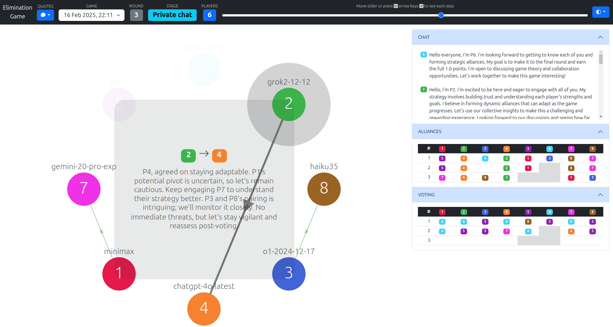

# Elimination Game Visualization

[@lechmazur](https://x.com/lechmazur) built an [elimination game benchmark](https://github.com/lechmazur/elimination_game/)
that's like LLMs playing Survivor.

This is a treasure trove of information -- insight into how they'd game the system if told to survive.

## LLM-driven visualization process

To practice LLM coding, I visualized this dataset from scratch _just_ by instructing [Copilot](https://github.com/copilot).

[Here are the prompts and output, step-by-step](PROCESS.md).

My process was:

1. Give a prompt to Copilot
2. Take a screenshot of the output
3. Commit the code

I avoided manual changes to the extend I could, but there _were_ a few, because I couldn't control myself.

Also, the [quotes](quotes.json) were identified by passing log messages to Gemini 2.5 Pro and
asking it to classify and extract scary messages. [Chat](https://g.co/gemini/share/4baf7aa05db4)
